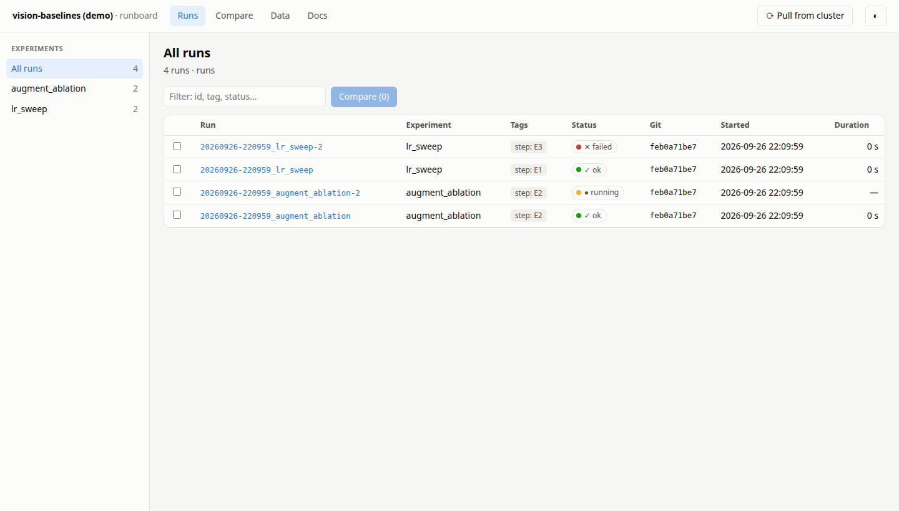
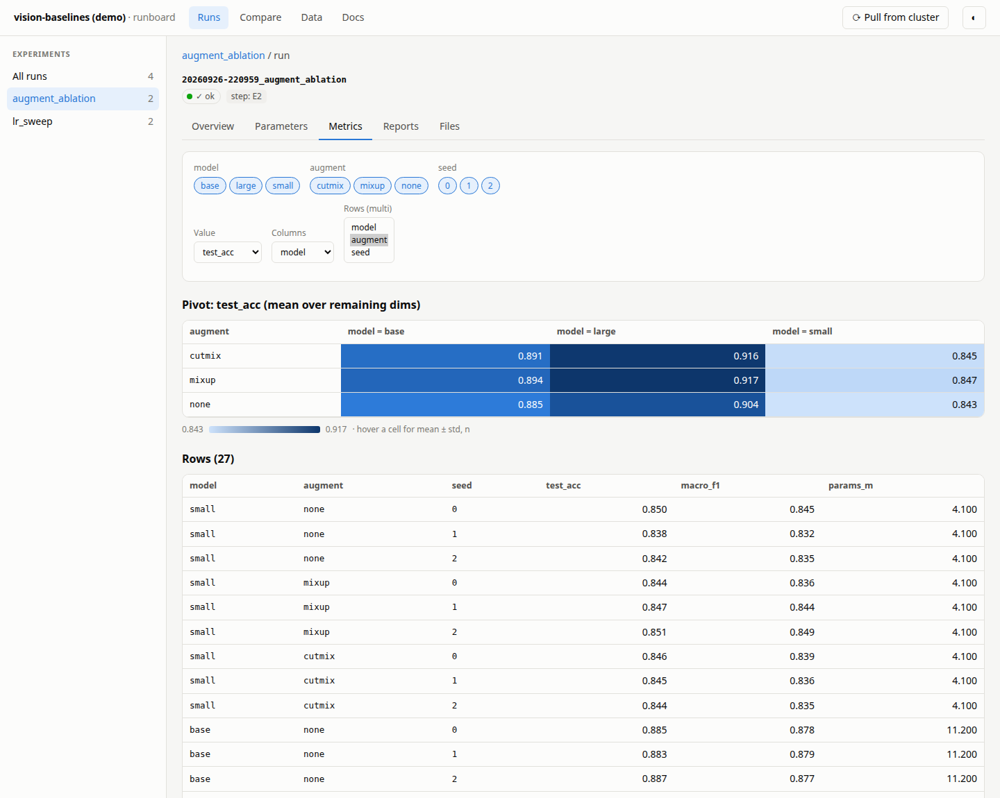
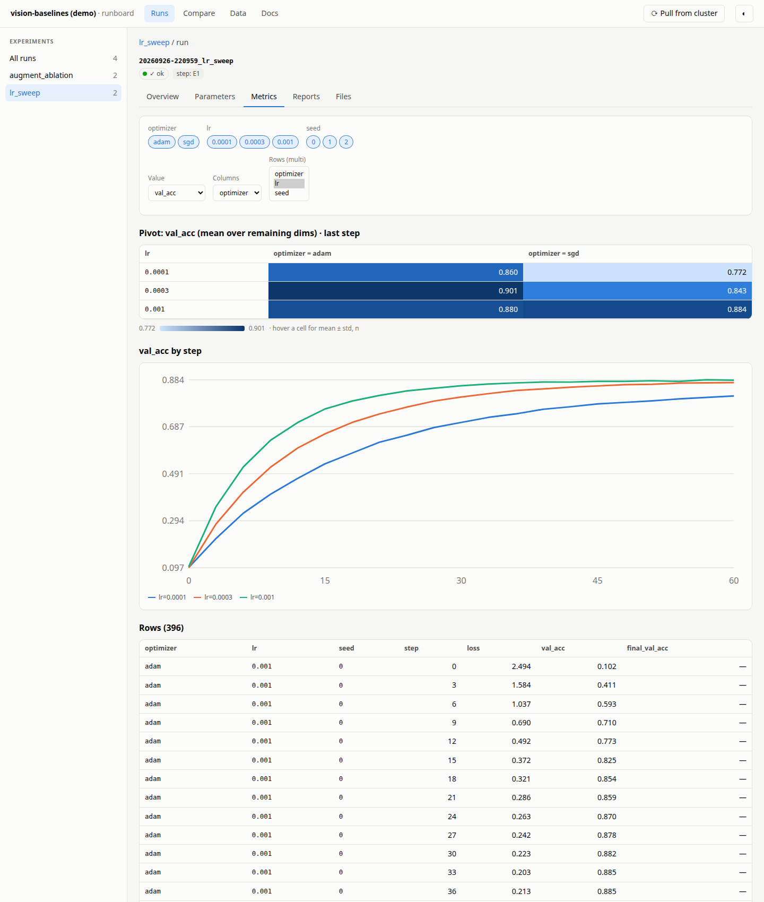
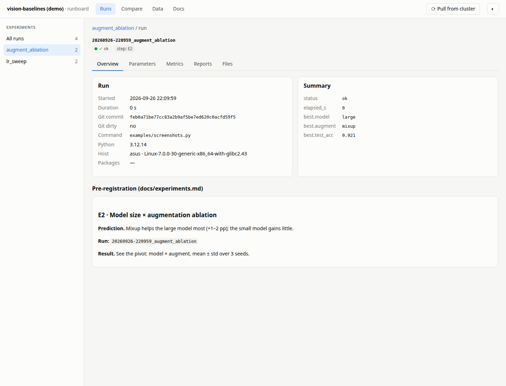
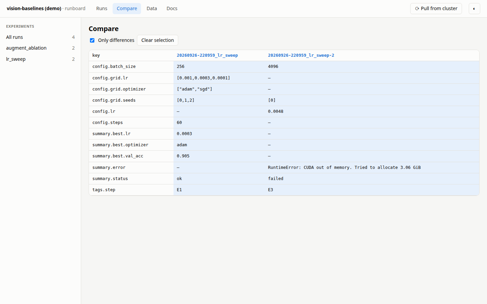
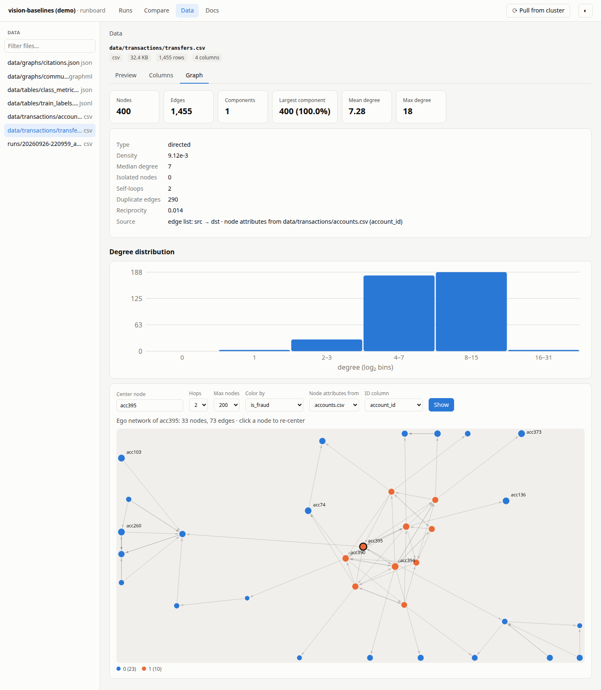
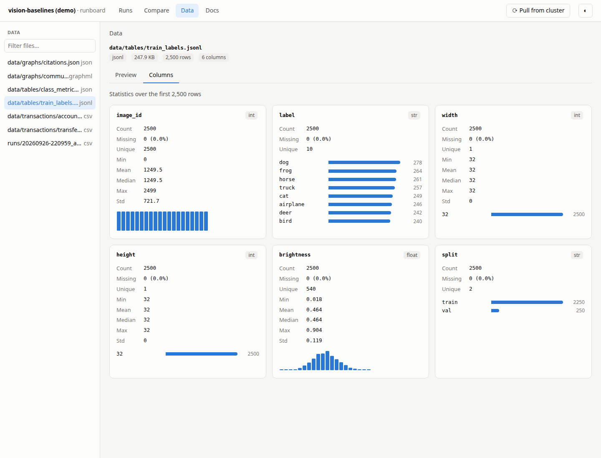
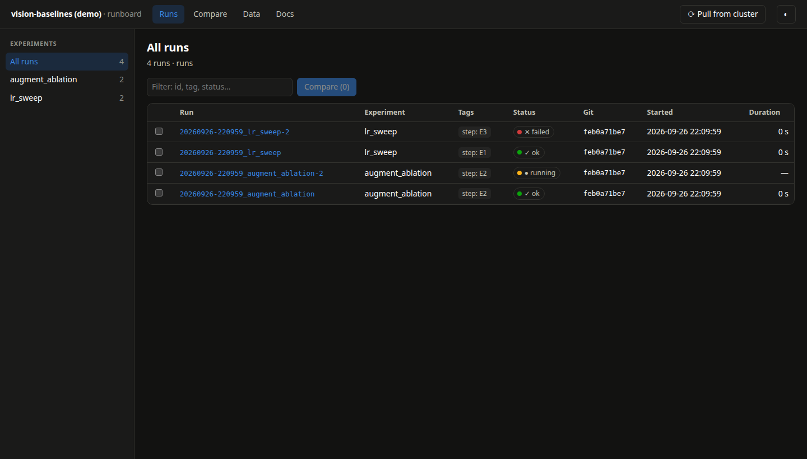
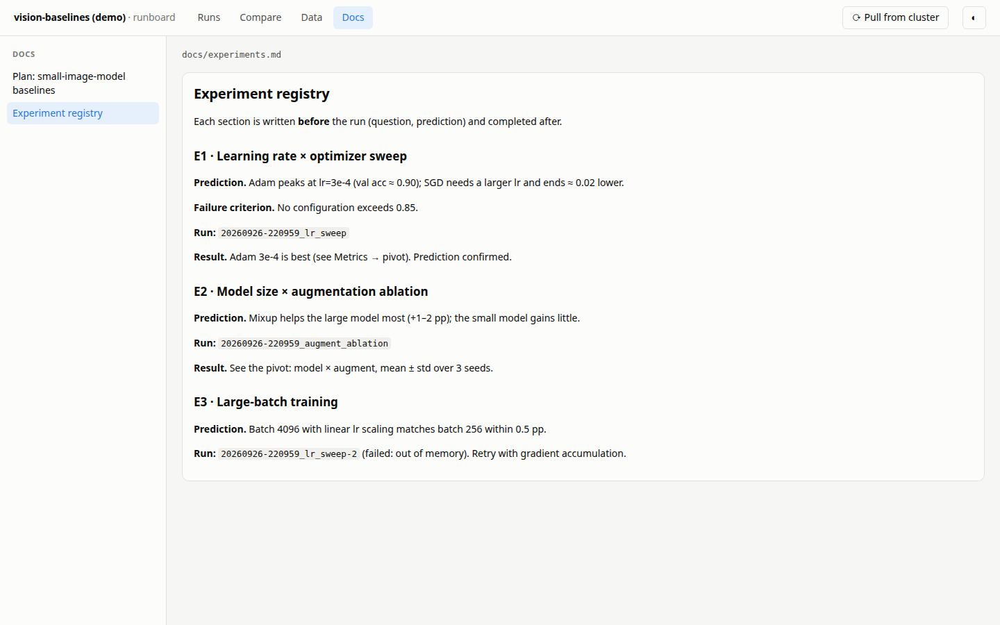

# runboard

File-based experiment tracking and a local, MLflow-like browser. No database, no
server to keep running, no dependencies beyond the Python standard library.

- **Tracking:** `Run` writes one plain directory per run (config, git state, code
  snapshot, metrics). The files are the storage, so runs can be diffed, synced with
  `rsync` and kept in git next to the code.
- **Browser:** `runboard` serves a single page over those directories: runs by
  experiment, parameters, metric pivots with heatmaps, step curves, run comparison,
  and your markdown docs. A run is shown **next to the doc section that
  pre-registered it** (see below).
- **Data:** tables (CSV, JSON, Parquet, …) with column statistics, and graphs
  (edge lists, GraphML, GEXF, GML, node-link JSON, MatrixMarket, `edge_index` NPZ)
  with degree statistics and an interactive ego-network view.



| | |
|---|---|
|  |  |
|  |  |
|  |  |
|  |  |

Screenshots show a synthetic demo project: `uv run python examples/make_demo.py /tmp/demo && runboard -C /tmp/demo`.
Regenerate them with `uv run python examples/screenshots.py` (needs Chrome or Chromium).

## Install

```bash
uv add git+https://github.com/kurmetov/runboard      # or: pip install git+https://github.com/kurmetov/runboard
```

For local development next to your project: `uv add --editable ../runboard`.

## Track

```python
from runboard import Run

grid = {"lr": [1e-3, 1e-4], "seeds": [0, 1, 2]}
with Run("sweep_lr", {"model": "small", "grid": grid}, tags={"step": "S1.2"}) as run:
    for lr in grid["lr"]:
        for seed in grid["seeds"]:
            for step in range(100):
                run.log({"loss": ...}, lr=lr, seed=seed, step=step)
    run.finish({"best_loss": ...})
```

- Runs go to `<git root>/runs/` (override with `root=`).
- Grid coordinates are passed as keyword context to `log`. The keys of
  `config["grid"]` (or an explicit `dims=[...]`) become pivot dimensions in the browser.
- `step` / `epoch` / `global_step` in logged rows turn into curves automatically.
- An exception inside the `with` block marks the run `failed`. Leaving the block
  without `finish` marks it `ok`.

## Browse

```bash
runboard                # serve on http://127.0.0.1:5050 (project = nearest runboard.toml, else cwd)
runboard --port 6000 --open
runboard ls             # recent runs in the terminal
runboard init           # write a runboard.toml template
```

## Data

The **Data** tab lists files under `datasets` folders (default `data/`) and in every run's `artifacts/`.

| Kind | Formats | Needs |
|---|---|---|
| Tables | CSV / TSV, JSON (records, columns), JSONL; also `.gz` | — |
| Tables | Parquet, Feather / Arrow IPC | `pyarrow` |
| Arrays | NPY, NPZ | `numpy` |
| Graphs | GraphML, GEXF, GML, node-link JSON (networkx), whitespace edge lists, MatrixMarket `.mtx` | — |
| Graphs | any table with `src/dst`, `source/target`, `from/to`, `u/v`, … columns; NPZ with `edge_index` or `row`/`col` | as above |

- **Tables:** paginated preview; per-column type, missing values, unique count,
  min / mean / median / max / std and a histogram or top values (first 200k rows).
- **Graphs:** node / edge counts, connected components, density, reciprocity,
  duplicate edges, self-loops, a log-binned degree histogram, and an ego network
  around any node (click a node to re-center). Nodes can be colored by an attribute,
  including one joined from a node table in the same folder (e.g. `users.csv` by `user_id`).
  The view is shareable: `?node=acc7&color=is_fraud&nodes=data/accounts.csv&node_id=account_id`.
- **Never loaded:** pickle-based files (`.pkl`, `.pt`, `.pth`, `.joblib`), because
  unpickling executes arbitrary code.

## Configure: `runboard.toml` (all keys optional)

```toml
title = "my project"
lang = "en"                          # "en" | "ru"
runs = "runs"
docs = "docs"                        # markdown shown in the Docs tab ("" to disable)
doc_order = ["plan", "experiments", "journal"]
prereg = ["docs/experiments.md"]     # default: all docs/*.md
prereg_tag = "step"
datasets = ["data"]                  # folders shown in the Data tab (run artifacts are always included)

[sync]                               # adds a button that runs this command in the project root
label = "Pull from server"
command = "rsync -az server:project/runs/ runs/"
```

### Pre-registration

The Overview tab shows the `## ...` section of your docs that belongs to the run:
first a section whose text contains the run id; otherwise a section whose heading
starts with the run's tag value (`## S1.2 ...` for `tags={"step": "S1.2"}`). Write
the question and prediction there before running, and paste the run id there
afterwards. The browser then shows prediction and result side by side.

## Run directory format (version 1)

```
runs/
  registry.jsonl                 one JSON line per finished run
  <YYYYmmdd-HHMMSS>_<experiment>/
    config.json                  the config passed to Run
    meta.json                    format, experiment, tags, dims, started_at, git_commit,
                                 git_dirty, git_untracked, argv, python, platform, host, packages
    git.diff                     `git diff HEAD` if tracked files changed
    code_snapshot.tar.gz         when dirty: every file git would track (≤ 1 MiB each,
                                 ≤ 50 MiB total), excluding the runs dir
    metrics.jsonl                one object per `log` call (+ "_t": seconds since start)
    summary.json                 {"status": "ok"|"failed", "elapsed_s": ..., ...}
    artifacts/                   your large outputs (git-ignore them)
```

A run without `summary.json` is shown as *running* while its files keep changing,
and as *incomplete* after 10 minutes of silence.

## Security

The server binds to `127.0.0.1` by default and serves only files inside run
directories, `docs/` and the configured `datasets` folders. The sync button runs **only** the command written in
`runboard.toml`. Do not expose the server on a public interface.
